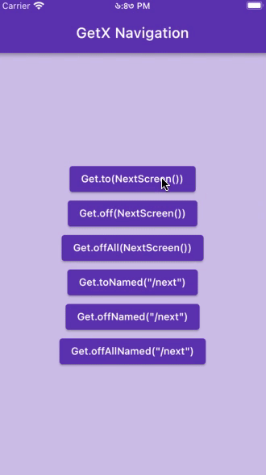

# GteX Tutorial - [Udemy](https://www.udemy.com/course/2022-dart-flutter-master-class-zero-to-hero/)

</img>
GetX is one of the most popular state management solution in flutter.
In addition to state management, GetX provides easy way to manage page routes.

## YouTube

Video on [YouTube](https://www.youtube.com/watch?v=vIIBp6xJJeA)

## Table of Contents

<table align="center" style="margin: 0px auto;">
  <tr>
    <th>No.</th>
    <th>Name</th>
    <th>Tasks</th>
    <th>Screenshots</th>
  </tr>
  <tr>
    <td>1</td>
    <td><a href="/lib/navigation/navigation.dart">Navigation</a></td>
    <td>
        Get.to() 
        Get.back() 
        Get.off() 
        Get.ofAll() 
        Get.toNamed() 
        Get.offNamed() 
        Get.offAllNamed()
    </td>
    <td></img></td>
  </tr>
</table>
