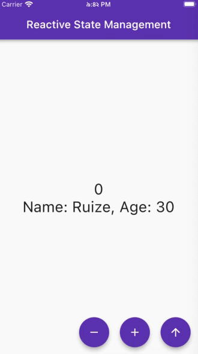
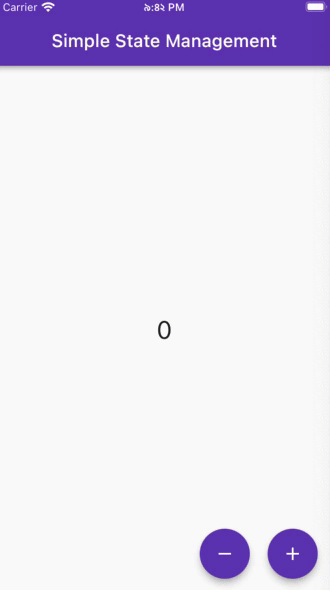
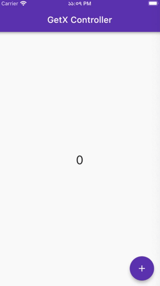
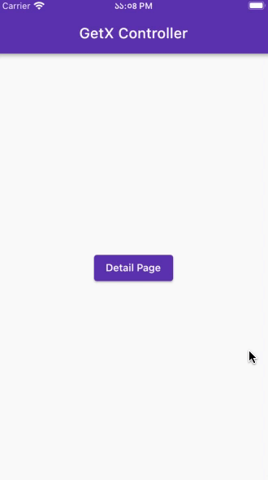
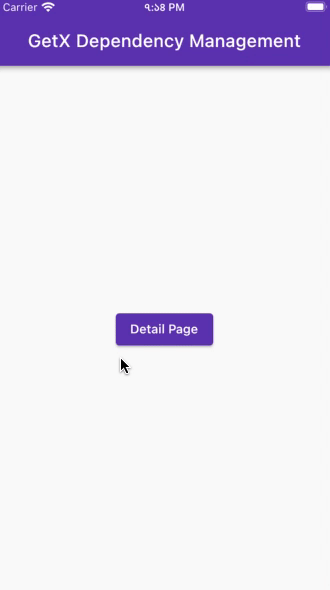
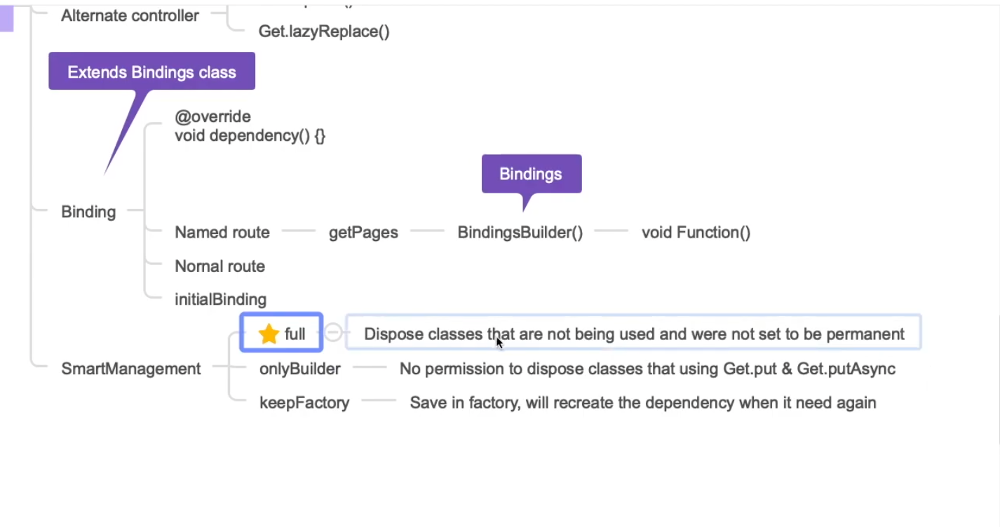

# GteX Tutorial - [Udemy](https://www.udemy.com/course/2022-dart-flutter-master-class-zero-to-hero/)

</img>
GetX is one of the most popular state management solution in flutter.
In addition to state management, GetX provides easy way to manage page routes.

## YouTube

Video on [YouTube](https://www.youtube.com/watch?v=vIIBp6xJJeA)

## Table of Contents

<table align="center" style="margin: 0px auto;">
  <tr>
    <th>No.</th>
    <th>Name</th>
    <th>Contents</th>
    <th>Screenshots</th>
  </tr>
  <tr>
    <td>1</td>
    <td><a href="/lib/1_navigation/navigation.dart">Navigation</a></td>
    <td>
        Get.to() 
        Get.back() 
        Get.off() 
        Get.ofAll() 
        Get.toNamed() 
        Get.offNamed() 
        Get.offAllNamed()
    </td>
    <td></img></td>
  </tr>
  <tr>
    <td>2</td>
    <td><a href="/lib/2_state_management/reactive/reactive_state_management.dart">Reactive State Management</a></td>
    <td>
        final name = ''.obs; 
        final isLogged = false.obs; 
        final count = 0.obs; 
        final balance = 0.0.obs; 
        final number = 0.obs; 
        final items = <String>[].obs; 
        final myMap = <String, int>{}.obs;  
        Obx(() =>Text('${count.value}'));  
        onPressed: () => increment()  
    </td>
    <td></img></td>
  </tr>
  <tr>
    <td>3</td>
    <td><a href="/lib/2_state_management/simple/simple_state_management.dart">Simple State Management</a></td>
    <td>
        class Controller extends GetxController {} 
        static Controller get to => Get.find(); 
        update();  
        GetBuilder<Controller>() 
        init: Controller(), 
        builder: (controller) => Text('${controller.counter}')
    </td>
    <td></img></td>
  </tr>
  <tr>
    <td>4</td>
    <td><a href="/lib/3_getx_controller/view.dart">Reactive State Controller</a></td>
    <td>
        GetX<Controller>() 
        init: Controller(), 
        builder: (controller) => Text()  
        In 'Controller' class: 
        final count = 0.obs; 
        &nbsp;&nbsp; void increment() { 
        &nbsp;&nbsp;&nbsp;&nbsp; count.value++; 
        &nbsp;&nbsp; }  
        &nbsp;&nbsp; void clearCount() { 
        &nbsp;&nbsp;&nbsp;&nbsp; count.value = 0; 
        &nbsp;&nbsp; }  
        &nbsp;&nbsp; void onInit() { { 
        &nbsp;&nbsp;&nbsp;&nbsp; super.onInit(); 
        &nbsp;&nbsp;&nbsp;&nbsp; ever(count, (_)); 
        &nbsp;&nbsp;&nbsp;&nbsp; everAll([count], (_)); 
        &nbsp;&nbsp;&nbsp;&nbsp; once(count, (_)); 
        &nbsp;&nbsp;&nbsp;&nbsp; debounce(count, (_)); 
        &nbsp;&nbsp;&nbsp;&nbsp; interval(count, (_)) 
        &nbsp;&nbsp; }
    </td>
    <td></img></td>
  </tr>
  <tr>
    <td>5</td>
    <td><a href="/lib/3_getx_controller/detail_page.dart">Simple State Controller</a></td>
    <td>
        final controller = Get.put(Controller()); 
        GetBuilder<Controller>() 
        id: 'count1', 
        builder: (controller) =>Text()  
        In 'Controller' class: 
        int count = 0; 
        &nbsp;&nbsp; void increment() { 
        &nbsp;&nbsp;&nbsp;&nbsp; count++; 
        &nbsp;&nbsp;&nbsp;&nbsp; update(); 
        &nbsp;&nbsp; }  
        &nbsp;&nbsp; void clearCount() { 
        &nbsp;&nbsp;&nbsp;&nbsp; count = 0; 
        &nbsp;&nbsp;&nbsp;&nbsp; update(); 
        &nbsp;&nbsp; } 
    </td>
    <td></img></td>
  </tr>
  <tr>
    <td>6</td>
    <td><a href="/lib/1_navigation/navigation.dart">Dependency Management</a></td>
    <td>
        Instancing methods 
        &nbsp;&nbsp;Get.put() 
        &nbsp;&nbsp;Get.lazyPut() 
        &nbsp;&nbsp;Get.putAsync() 
        &nbsp;&nbsp;Get.create() 
        &nbsp;&nbsp;Get.delete()  
        Find controller 
        &nbsp;&nbsp;final controller = Get.find< Controller>(); 
        &nbsp;&nbsp;Controller controller = Get.find(); 
        Alternate controller 
        &nbsp;&nbsp;Get.replace() 
        &nbsp;&nbsp;Get.lazyReplace()  
        Binding 
        &nbsp;&nbsp;void dependency(){} 
        &nbsp;&nbsp;Named route > getPages > BindingBuilder() > void Function 
        &nbsp;&nbsp;Named route 
        &nbsp;&nbsp;initialBinding  
        SmartManagement 
        &nbsp;&nbsp;✰ full 
        &nbsp;&nbsp;onlyBuilder 
        &nbsp;&nbsp;keepFactory 
    </td>
    <td></img></td>
  </tr>

</table>

## Life Cycle of GetX Controller

</img>
</img>

## Dependency Management using GetX

</img>
</img>
