&nbsp;&nbsp;
&nbsp;&nbsp;
<a href="https://choosealicense.com/licenses/mit/" target="_blank"></a>&nbsp;&nbsp;


# GteX Tutorial - [Udemy](https://www.udemy.com/course/2022-dart-flutter-master-class-zero-to-hero/)

</img>
GetX is one of the most popular state management solution in flutter.
In addition to state management, GetX provides easy way to manage page routes.

## YouTube

Video on [YouTube](https://www.youtube.com/watch?v=vIIBp6xJJeA)

## For [JSON Viewer Pro](https://chrome.google.com/webstore/detail/json-viewer-pro/eifflpmocdbdmepbjaopkkhbfmdgijcc)

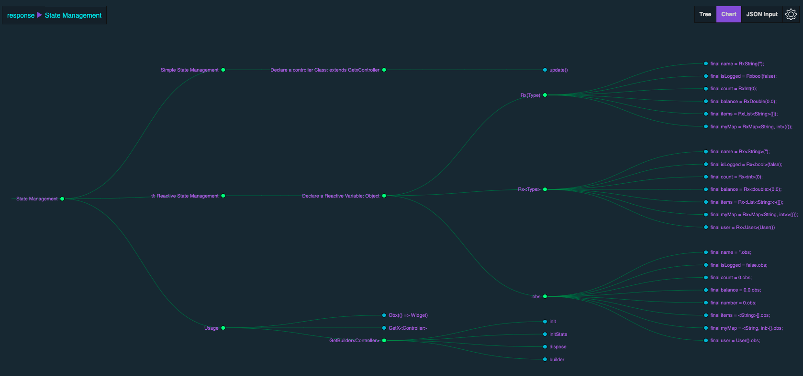</img>

0. [GetX](https://jsonkeeper.com/b/B4WJ)
1. [Navigation](https://jsonkeeper.com/b/LU24)
2. [State Management](https://jsonkeeper.com/b/0OSR)
3. [GetX Controller](https://jsonkeeper.com/b/08T2)
4. [Dependency Management](https://jsonkeeper.com/b/ESXV)
5. [Translation](https://jsonkeeper.com/b/1E6M)
6. [Themes](https://jsonkeeper.com/b/9XMT)
7. [GetXService & GetView](https://jsonkeeper.com/b/Y2JV)
8. [GetWidget](https://jsonkeeper.com/b/4QJS)
9. [GetConnect](https://jsonkeeper.com/b/LC6P)
10. [GetX Pattern](https://jsonkeeper.com/b/TI0Z)
11. [Utils](https://jsonkeeper.com/b/K7O1)

<br>JSON files are hosted by [jsonkeeper](https://jsonkeeper.com/)

## Table of Contents

<table align="center" style="margin: 0px auto;">
  <tr>
    <th>No.</th>
    <th>Name</th>
    <th>Contents</th>
    <th>Screenshots</th>
  </tr>
  <tr>
    <td>1</td>
    <td><a href="/lib/1_navigation/navigation.dart">Navigation</a></td>
    <td>
        Get.to()<br>
        Get.back()<br>
        Get.off()<br>
        Get.ofAll()<br>
        Get.toNamed()<br>
        Get.offNamed()<br>
        Get.offAllNamed()
    </td>
    <td>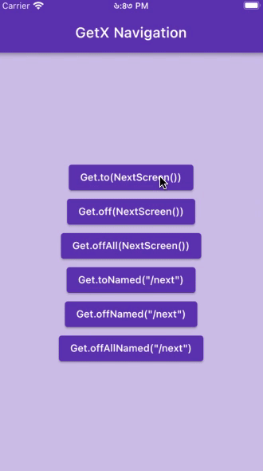</img></td>
  </tr>
  <tr>
    <td>2</td>
    <td><a href="/lib/2_state_management/reactive/reactive_state_management.dart">Reactive State Management</a></td>
    <td>
        final name = ''.obs;<br>
        final isLogged = false.obs;<br>
        final count = 0.obs;<br>
        final balance = 0.0.obs;<br>
        final number = 0.obs;<br>
        final items = <String>[].obs;<br>
        final myMap = <String, int>{}.obs;<br><br>
        Obx(() =>Text('${count.value}'));<br><br>
        onPressed: () => increment()  
    </td>
    <td>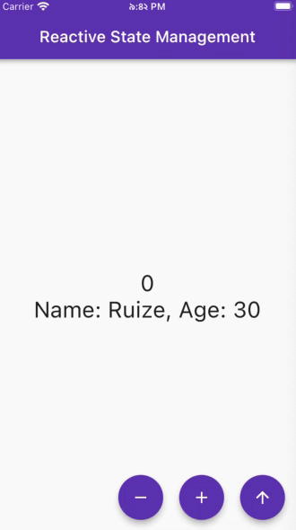</img></td>
  </tr>
  <tr>
    <td>3</td>
    <td><a href="/lib/2_state_management/simple/simple_state_management.dart">Simple State Management</a></td>
    <td>
        class Controller extends GetxController {}<br>
        static Controller get to => Get.find();<br>
        update();<br><br>
        GetBuilder<Controller>()<br>
        init: Controller(),<br>
        builder: (controller) => Text('${controller.counter}')
    </td>
    <td>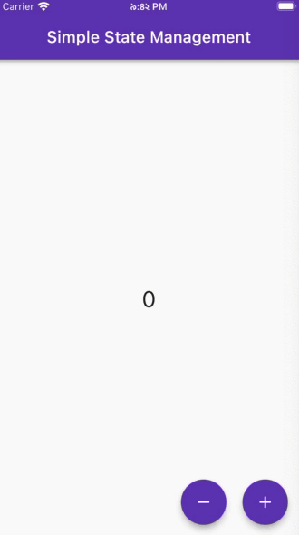</img></td>
  </tr>
  <tr>
    <td>4</td>
    <td><a href="/lib/3_getx_controller/view.dart">Reactive State Controller</a></td>
    <td>
        GetX<Controller>()<br>
        init: Controller(),<br>
        builder: (controller) => Text()<br><br>
        In 'Controller' class:<br>
        final count = 0.obs;<br>
         &nbsp;&nbsp; void increment() {<br>
         &nbsp;&nbsp;&nbsp;&nbsp; count.value++;<br>
         &nbsp;&nbsp; }<br><br>
         &nbsp;&nbsp; void clearCount() {<br>
         &nbsp;&nbsp;&nbsp;&nbsp; count.value = 0;<br>
         &nbsp;&nbsp; }<br><br>
         &nbsp;&nbsp; void onInit() { {<br>
         &nbsp;&nbsp;&nbsp;&nbsp; super.onInit();<br>
         &nbsp;&nbsp;&nbsp;&nbsp; ever(count, (_));<br>
         &nbsp;&nbsp;&nbsp;&nbsp; everAll([count], (_));<br>
         &nbsp;&nbsp;&nbsp;&nbsp; once(count, (_));<br>
         &nbsp;&nbsp;&nbsp;&nbsp; debounce(count, (_));<br>
         &nbsp;&nbsp;&nbsp;&nbsp; interval(count, (_))<br>
         &nbsp;&nbsp; }
    </td>
    <td>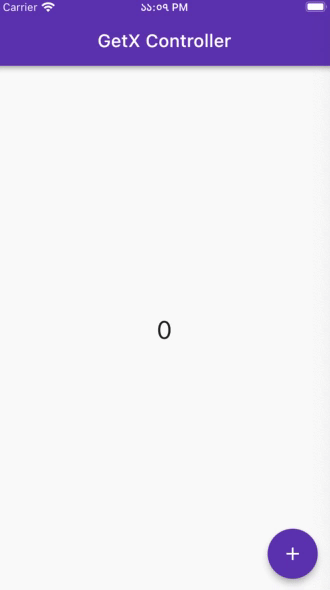</img></td>
  </tr>
  <tr>
    <td>5</td>
    <td><a href="/lib/3_getx_controller/detail_page.dart">Simple State Controller</a></td>
    <td>
        final controller = Get.put(Controller());<br>
        GetBuilder<Controller>()<br>
        id: 'count1',<br>
        builder: (controller) =>Text()<br><br>
        In 'Controller' class:<br>
        int count = 0;<br>
         &nbsp;&nbsp; void increment() {<br>
         &nbsp;&nbsp;&nbsp;&nbsp; count++;<br>
         &nbsp;&nbsp;&nbsp;&nbsp; update();<br>
         &nbsp;&nbsp; }<br><br>
         &nbsp;&nbsp; void clearCount() {<br>
         &nbsp;&nbsp;&nbsp;&nbsp; count = 0;<br>
         &nbsp;&nbsp;&nbsp;&nbsp; update();<br>
         &nbsp;&nbsp; }<br>
    </td>
    <td>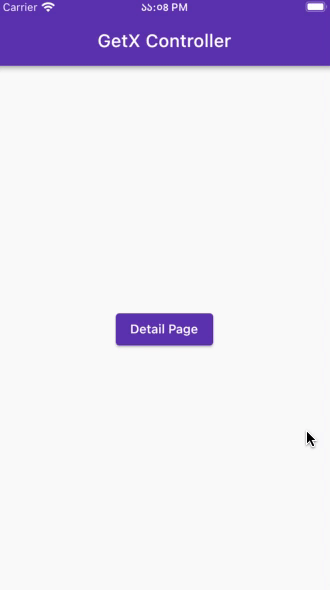</img></td>
  </tr>
  <tr>
    <td>6</td>
    <td><a href="/lib/4_dependency_management/view.dart">Dependency Management</a></td>
    <td>
        Instancing methods<br>
         &nbsp;&nbsp;Get.put()<br>
         &nbsp;&nbsp;Get.lazyPut()<br>
         &nbsp;&nbsp;Get.putAsync()<br>
         &nbsp;&nbsp;Get.create()<br>
         &nbsp;&nbsp;Get.delete()<br><br>
        Find controller<br>
         &nbsp;&nbsp;final controller = Get.find< Controller>();<br>
         &nbsp;&nbsp;Controller controller = Get.find();<br>
        Alternate controller<br>
         &nbsp;&nbsp;Get.replace()<br>
         &nbsp;&nbsp;Get.lazyReplace()<br><br>
        Binding<br>
         &nbsp;&nbsp;void dependency(){}<br>
         &nbsp;&nbsp;Named route > getPages > BindingBuilder() > void Function<br>
         &nbsp;&nbsp;Named route<br>
         &nbsp;&nbsp;initialBinding<br><br>
        SmartManagement<br>
         &nbsp;&nbsp;✰ full<br>
         &nbsp;&nbsp;onlyBuilder<br>
         &nbsp;&nbsp;keepFactory<br>
    </td>
    <td>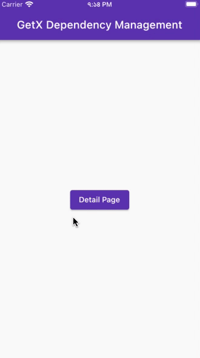</img></td>
  </tr>
  <tr>
    <td>7</td>
    <td><a href="/lib/5_translations/translations_example.dart">Internationalization</a></td>
    <td>
        Custom class<br>
         &nbsp;&nbsp;@override<br>
         &nbsp;&nbsp;Map< String, Map< String, String>> get keys<br><br>
        tr > Text('key'.tr)<br><br>
        @key > trParams({'key':'value'})<br><br>
        translations<br>
         &nbsp;&nbsp;Custom class that extends Translations<br><br>
        locale<br>
         &nbsp;&nbsp;Locale()<br>
         &nbsp;&nbsp;Get.deviceLocale()<br>
         &nbsp;&nbsp;Get.updateLocale()<br><br>
        fallbackLocale<br>
         &nbsp;&nbsp;Locale()<br>
    </td>
    <td>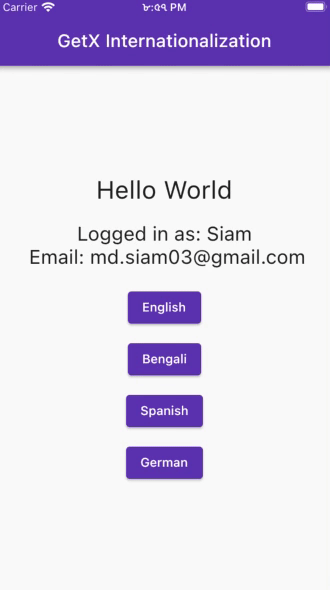</img></td>
  </tr>
  <tr>
    <td>8</td>
    <td><a href="/lib/6_themes/themes_example.dart">Change Theme</a></td>
    <td>
        void main() async {<br>
        &nbsp;&nbsp;await GetStorage.init();<br>
        &nbsp;&nbsp;runApp(const MyApp());<br>
        }<br><br>
        Create theme file<br><br>
        Config lightTheme & darkTheme<br><br>
        Change theme dynamically<br>
         &nbsp;&nbsp;Get.isDarkMode > bool<br>
         &nbsp;&nbsp;Get.changeThemeMode()<br>
         &nbsp;&nbsp;Get.changeTheme()<br><br>
        Store them in local storage<br>
         &nbsp;&nbsp;GetStorage() > read() & write()<br>
    </td>
    <td>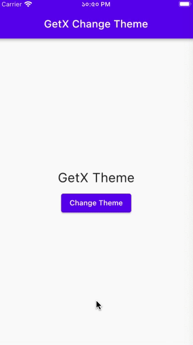</img></td>
  </tr>
  <tr>
    <td>9</td>
    <td><a href="/lib/1_navigation/navigation.dart">GetX Service & GetView</a></td>
    <td>
        void main() async {<br>
        &nbsp;&nbsp;WidgetsFlutterBinding.ensureInitialized();<br>
        &nbsp;&nbsp;await initServices();<br>
        &nbsp;&nbsp;runApp(const MyApp());<br>
        }<br><br>
        GetView< SettingsService><br><br>
        late SharedPreferences _prefs;<br>
        final counter = 0.obs;<br>
    </td>
    <td>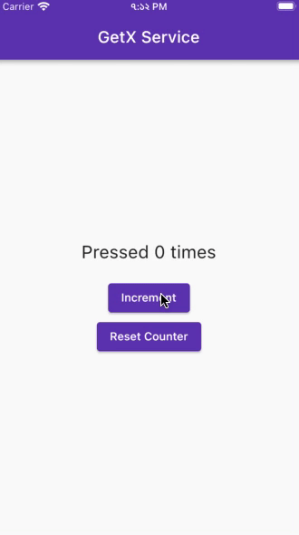</img></td>
  </tr>

</table>

## Directory

```
    lib/
    ├── 1_navigation/
    │   ├── navigation.dart
    │   └── next_screen.dart
    ├── 2_state_management/
    │   ├── reactive/
    │   │   ├── reactive_state_management.dart
    │   │   └── user.dart
    │   └── simple/
    │       ├── simple_state_controller.dart
    │       └── simple_state_management.dart
    ├── 3_getx_controller/
    │   ├── controller.dart
    │   ├── detail_page.dart
    │   └── view.dart
    ├── 4_dependency_management/
    │   ├── binding.dart
    │   ├── class.dart
    │   ├── controller.dart
    │   ├── detail_page.dart
    │   └── view.dart
    ├── 5_translations/
    │   ├── messages.dart
    │   ├── translations_controller.dart
    │   ├── translations_example.dart
    │   └── translations_view.dart
    ├── 6_themes/
    │   ├── themes_controller.dart
    │   ├── themes_example.dart
    │   ├── themes_view.dart
    │   └── themes.dart
    ├── 7_getx_service_&_get_view/
    │   ├── service_view.dart
    │   ├── service_example.dart
    │   └── settings_service.dart
    ├── 8_get_widget/
    │   └── get_widget_example.dart
    ├── 9_get_connect/
    │   └── get_connect_example.dart
    ├── 10_get_pattern/
    │   └── get_pattern_example.dart
    ├── main.dart
    └── routes.dart
```

## Life Cycle of GetX Controller

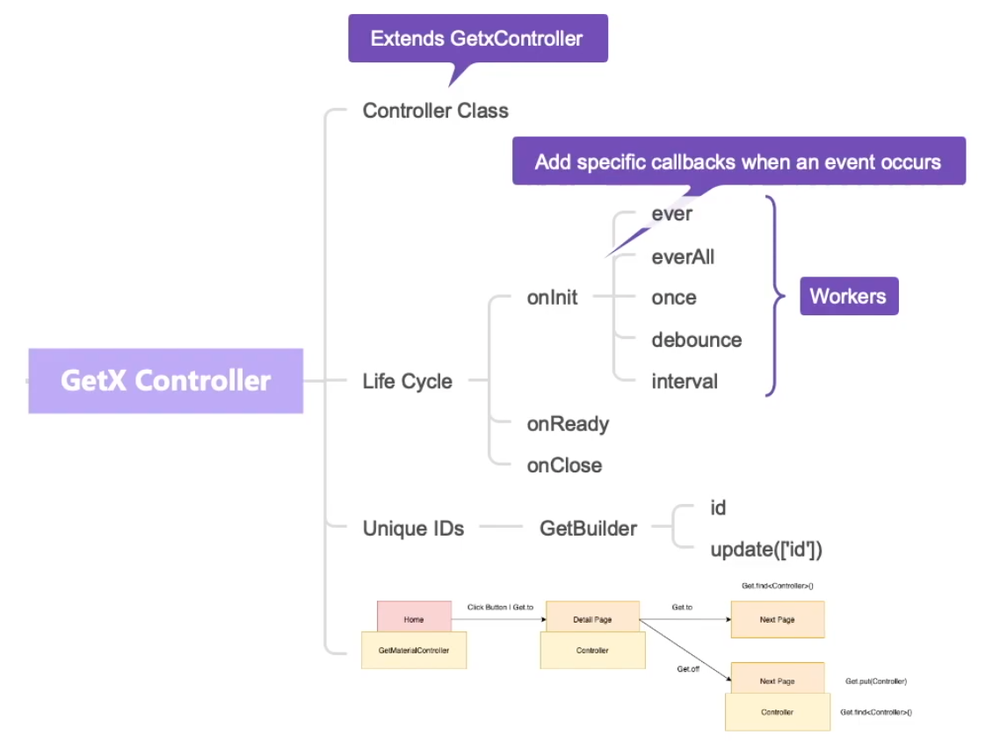</img>
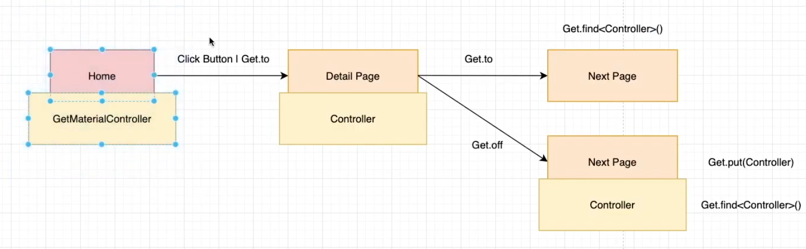</img>

## Dependency Management using GetX

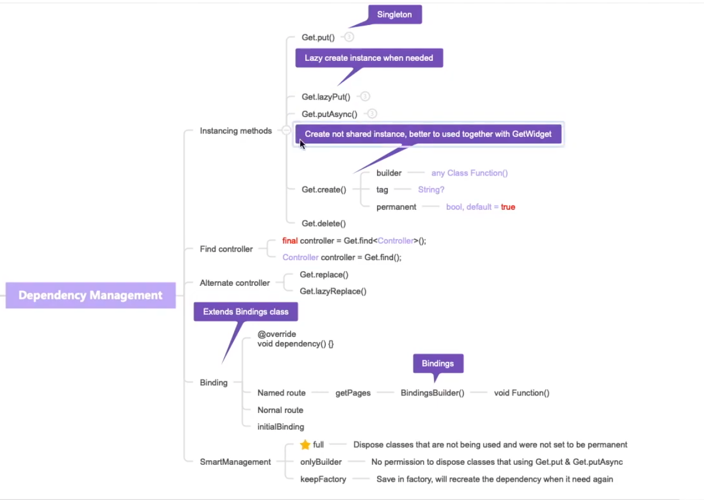</img>

## Internationalization/Translations using GetX

For language code: `http://lingoes.net/en/translator/langcode.htm` <br>
For language code: `https://www.science.co.il/language/Codes.php`<br>

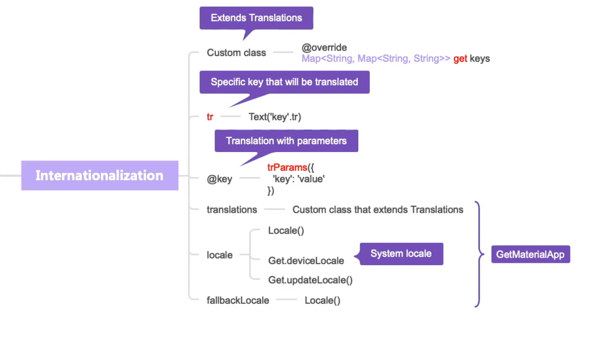</img>
